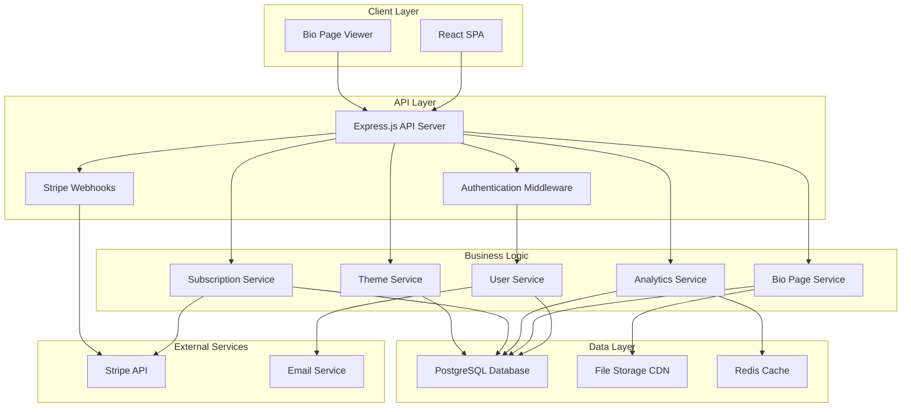

# Design Document

## Overview

LinkHub is a modern SaaS application built using a full-stack TypeScript architecture with React frontend and Node.js/Express backend. The system follows a component-driven design with clear separation between presentation, business logic, and data layers. The application uses PostgreSQL for data persistence, Stripe for subscription management, and implements property-based testing for correctness validation.

The architecture prioritizes simplicity, maintainability, and scalability while keeping operational overhead minimal for a single-person business. All components are designed to run on a single server initially, with clear paths for horizontal scaling as the business grows.

## Architecture

### System Architecture



### Technology Stack

**Frontend:**
- React 18 with TypeScript for type safety and component reusability
- Vite for fast development and optimized builds
- Tailwind CSS for utility-first styling and consistent design
- React Router for client-side routing
- React Query for server state management and caching

**Backend:**
- Node.js with Express.js for API server
- TypeScript for type safety across the entire stack
- PostgreSQL with Prisma ORM for type-safe database operations
- Redis for session storage and caching
- JWT for stateless authentication

**Infrastructure:**
- Single VPS deployment (DigitalOcean/Linode)
- Nginx as reverse proxy and static file server
- PM2 for process management
- Automated backups for PostgreSQL
- CloudFlare CDN for global content delivery

## Components and Interfaces

### Core Services

#### User Service
Handles user registration, authentication, and profile management.

```typescript
interface UserService {
  register(email: string, password: string): Promise<User>
  authenticate(email: string, password: string): Promise<AuthResult>
  resetPassword(email: string): Promise<void>
  updateProfile(userId: string, profile: ProfileUpdate): Promise<User>
  claimUsername(userId: string, username: string): Promise<void>
}

interface User {
  id: string
  email: string
  username: string | null
  profileName: string | null
  profileBio: string | null
  profileImageUrl: string | null
  subscriptionTier: 'free' | 'premium'
  createdAt: Date
  updatedAt: Date
}
```

#### Bio Page Service
Manages bio page creation, editing, and public rendering.

```typescript
interface BioPageService {
  createPage(userId: string): Promise<BioPage>
  updatePage(userId: string, updates: BioPageUpdate): Promise<BioPage>
  getPageByUsername(username: string): Promise<BioPage | null>
  addLink(userId: string, link: LinkItem): Promise<BioPage>
  removeLink(userId: string, linkId: string): Promise<BioPage>
  reorderLinks(userId: string, linkIds: string[]): Promise<BioPage>
}

interface BioPage {
  id: string
  userId: string
  username: string
  profileName: string
  profileBio: string
  profileImageUrl: string | null
  themeId: string
  customColors: ThemeColors | null
  links: LinkItem[]
  isPublished: boolean
  createdAt: Date
  updatedAt: Date
}

interface LinkItem {
  id: string
  title: string
  url: string
  iconName: string | null
  isActive: boolean
  order: number
}
```

#### Analytics Service
Tracks page views and link clicks with privacy-focused approach.

```typescript
interface AnalyticsService {
  recordPageView(username: string, visitorInfo: VisitorInfo): Promise<void>
  recordLinkClick(username: string, linkId: string, visitorInfo: VisitorInfo): Promise<void>
  getPageStats(userId: string, timeRange: TimeRange): Promise<PageStats>
  getLinkStats(userId: string, timeRange: TimeRange): Promise<LinkStats[]>
}

interface PageStats {
  totalViews: number
  uniqueVisitors: number
  dailyViews: DailyStats[]
  topReferrers: ReferrerStats[]
}

interface VisitorInfo {
  ipHash: string  // Hashed for privacy
  userAgent: string
  referrer: string | null
  timestamp: Date
}
```

#### Subscription Service
Integrates with Stripe for subscription management.

```typescript
interface SubscriptionService {
  createCheckoutSession(userId: string, priceId: string): Promise<CheckoutSession>
  handleWebhook(event: StripeEvent): Promise<void>
  cancelSubscription(userId: string): Promise<void>
  getSubscriptionStatus(userId: string): Promise<SubscriptionStatus>
  upgradeSubscription(userId: string, newPriceId: string): Promise<void>
}

interface SubscriptionStatus {
  isActive: boolean
  tier: 'free' | 'premium'
  currentPeriodEnd: Date | null
  cancelAtPeriodEnd: boolean
  stripeCustomerId: string | null
  stripeSubscriptionId: string | null
}
```

#### Theme Service
Manages visual themes and customization options.

```typescript
interface ThemeService {
  getAvailableThemes(subscriptionTier: string): Promise<Theme[]>
  applyTheme(userId: string, themeId: string): Promise<void>
  updateCustomColors(userId: string, colors: ThemeColors): Promise<void>
  renderPageWithTheme(bioPage: BioPage, theme: Theme): Promise<string>
}

interface Theme {
  id: string
  name: string
  isPremium: boolean
  previewImageUrl: string
  cssTemplate: string
  colorVariables: string[]
}

interface ThemeColors {
  primary: string
  secondary: string
  background: string
  text: string
}
```

### API Endpoints

**Authentication Routes:**
- `POST /api/auth/register` - User registration
- `POST /api/auth/login` - User login
- `POST /api/auth/logout` - User logout
- `POST /api/auth/reset-password` - Password reset request
- `POST /api/auth/confirm-reset` - Password reset confirmation

**User Routes:**
- `GET /api/user/profile` - Get user profile
- `PUT /api/user/profile` - Update user profile
- `POST /api/user/claim-username` - Claim username
- `GET /api/user/subscription` - Get subscription status

**Bio Page Routes:**
- `GET /api/bio-page` - Get user's bio page
- `PUT /api/bio-page` - Update bio page
- `POST /api/bio-page/links` - Add new link
- `PUT /api/bio-page/links/:id` - Update link
- `DELETE /api/bio-page/links/:id` - Delete link
- `PUT /api/bio-page/links/reorder` - Reorder links

**Public Routes:**
- `GET /:username` - Render public bio page
- `POST /api/analytics/view/:username` - Record page view
- `POST /api/analytics/click/:username/:linkId` - Record link click

**Analytics Routes:**
- `GET /api/analytics/stats` - Get page statistics
- `GET /api/analytics/links` - Get link statistics

**Subscription Routes:**
- `POST /api/subscription/checkout` - Create Stripe checkout session
- `POST /api/subscription/cancel` - Cancel subscription
- `POST /api/webhooks/stripe` - Handle Stripe webhooks

**Theme Routes:**
- `GET /api/themes` - Get available themes
- `PUT /api/themes/apply` - Apply theme to bio page
- `PUT /api/themes/colors` - Update custom colors

## Data Models

### Database Schema

```sql
-- Users table
CREATE TABLE users (
  id UUID PRIMARY KEY DEFAULT gen_random_uuid(),
  email VARCHAR(255) UNIQUE NOT NULL,
  password_hash VARCHAR(255) NOT NULL,
  username VARCHAR(50) UNIQUE,
  profile_name VARCHAR(100),
  profile_bio TEXT,
  profile_image_url VARCHAR(500),
  subscription_tier VARCHAR(20) DEFAULT 'free',
  stripe_customer_id VARCHAR(100),
  created_at TIMESTAMP DEFAULT NOW(),
  updated_at TIMESTAMP DEFAULT NOW()
);

-- Bio pages table
CREATE TABLE bio_pages (
  id UUID PRIMARY KEY DEFAULT gen_random_uuid(),
  user_id UUID REFERENCES users(id) ON DELETE CASCADE,
  theme_id VARCHAR(50) DEFAULT 'default',
  custom_colors JSONB,
  is_published BOOLEAN DEFAULT true,
  created_at TIMESTAMP DEFAULT NOW(),
  updated_at TIMESTAMP DEFAULT NOW()
);

-- Links table
CREATE TABLE links (
  id UUID PRIMARY KEY DEFAULT gen_random_uuid(),
  bio_page_id UUID REFERENCES bio_pages(id) ON DELETE CASCADE,
  title VARCHAR(100) NOT NULL,
  url VARCHAR(500) NOT NULL,
  icon_name VARCHAR(50),
  is_active BOOLEAN DEFAULT true,
  order_index INTEGER NOT NULL,
  created_at TIMESTAMP DEFAULT NOW(),
  updated_at TIMESTAMP DEFAULT NOW()
);

-- Analytics events table
CREATE TABLE analytics_events (
  id UUID PRIMARY KEY DEFAULT gen_random_uuid(),
  bio_page_id UUID REFERENCES bio_pages(id) ON DELETE CASCADE,
  event_type VARCHAR(20) NOT NULL, -- 'page_view' or 'link_click'
  link_id UUID REFERENCES links(id) ON DELETE SET NULL,
  visitor_ip_hash VARCHAR(64) NOT NULL,
  user_agent TEXT,
  referrer VARCHAR(500),
  created_at TIMESTAMP DEFAULT NOW()
);

-- Subscriptions table
CREATE TABLE subscriptions (
  id UUID PRIMARY KEY DEFAULT gen_random_uuid(),
  user_id UUID REFERENCES users(id) ON DELETE CASCADE,
  stripe_subscription_id VARCHAR(100) UNIQUE,
  status VARCHAR(20) NOT NULL,
  current_period_end TIMESTAMP,
  cancel_at_period_end BOOLEAN DEFAULT false,
  created_at TIMESTAMP DEFAULT NOW(),
  updated_at TIMESTAMP DEFAULT NOW()
);

-- Themes table
CREATE TABLE themes (
  id VARCHAR(50) PRIMARY KEY,
  name VARCHAR(100) NOT NULL,
  is_premium BOOLEAN DEFAULT false,
  preview_image_url VARCHAR(500),
  css_template TEXT NOT NULL,
  color_variables JSONB,
  created_at TIMESTAMP DEFAULT NOW()
);
```

### Data Serialization

The system uses JSON for data serialization between client and server, with TypeScript interfaces ensuring type safety. All database operations use Prisma ORM which handles serialization automatically.

**Bio Page JSON Structure:**
```json
{
  "id": "uuid",
  "username": "johndoe",
  "profileName": "John Doe",
  "profileBio": "Software developer and content creator",
  "profileImageUrl": "https://cdn.example.com/images/profile.jpg",
  "themeId": "modern-dark",
  "customColors": {
    "primary": "#3b82f6",
    "secondary": "#1e40af",
    "background": "#0f172a",
    "text": "#f8fafc"
  },
  "links": [
    {
      "id": "uuid",
      "title": "My Website",
      "url": "https://johndoe.com",
      "iconName": "globe",
      "isActive": true,
      "order": 1
    }
  ],
  "isPublished": true
}
```

## Correctness Properties

*A property is a characteristic or behavior that should hold true across all valid executions of a system-essentially, a formal statement about what the system should do. Properties serve as the bridge between human-readable specifications and machine-verifiable correctness guarantees.*

<function_calls>
<invoke name="prework">
<parameter name="featureName">link-in-bio-saas

Based on the prework analysis, I'll now perform property reflection to eliminate redundancy:

**Property Reflection:**
- Properties 9.3 and 9.4 (serialization/deserialization) can be combined into a single round-trip property
- Properties 5.1 and 5.2 (analytics recording) can be combined into a general analytics tracking property
- Properties 6.2, 6.3, 6.4, 6.5 (subscription state management) can be combined into comprehensive subscription lifecycle properties
- Properties 10.1 and 10.2 (meta tags and OG tags) can be combined into a general SEO metadata property

### Property 1: User Registration Creates Valid Accounts
*For any* valid email and password combination, registering a new user should create a user account and trigger email verification
**Validates: Requirements 1.1**

### Property 2: Authentication Works for Valid Credentials
*For any* registered user, authenticating with correct credentials should create a valid session
**Validates: Requirements 1.2**

### Property 3: Authentication Rejects Invalid Credentials
*For any* invalid credential combination, authentication attempts should be rejected with appropriate error messages
**Validates: Requirements 1.3**

### Property 4: Password Reset Works for Registered Users
*For any* registered user, requesting a password reset should send a reset link to their email
**Validates: Requirements 1.4**

### Property 5: Duplicate Email Registration is Rejected
*For any* email address already in use, attempting to register with that email should be rejected
**Validates: Requirements 1.5**

### Property 6: Username Validation Enforces Format Rules
*For any* username input, the system should accept only strings containing lowercase letters, numbers, and hyphens
**Validates: Requirements 2.2**

### Property 7: Username Uniqueness is Enforced
*For any* username already claimed, attempting to claim the same username should be rejected
**Validates: Requirements 2.3**

### Property 8: Username Claims Create Accessible URLs
*For any* successfully claimed username, the bio page should be accessible at the URL path /{username}
**Validates: Requirements 2.4**

### Property 9: Username Changes Work When Available
*For any* user and available username, changing to that username should update the URL path accordingly
**Validates: Requirements 2.5**

### Property 10: Link Management Preserves Data Integrity
*For any* bio page, adding, removing, or reordering links should maintain data consistency and proper ordering
**Validates: Requirements 3.3, 3.4, 3.5**

### Property 11: Bio Page Data Persistence Round Trip
*For any* bio page data, saving then retrieving should produce equivalent data (serialization round-trip)
**Validates: Requirements 3.6, 9.1, 9.3, 9.4**

### Property 12: Premium Feature Access Control
*For any* free user, attempting to access premium features should prompt for upgrade, while premium users should have full access
**Validates: Requirements 4.3, 6.3**

### Property 13: Theme Customization Applies Correctly
*For any* premium user and valid color combination, applying custom theme colors should render correctly on their bio page
**Validates: Requirements 4.4, 4.5**

### Property 14: Analytics Tracking Records All Events
*For any* page view or link click, the analytics service should record the event with accurate timestamp and metadata
**Validates: Requirements 5.1, 5.2**

### Property 15: Analytics Aggregation is Accurate
*For any* set of recorded events, the analytics dashboard should display correct totals and breakdowns
**Validates: Requirements 5.3, 5.4, 5.5**

### Property 16: Stripe Integration Creates Valid Checkout Sessions
*For any* user initiating an upgrade, the system should create a valid Stripe checkout session with correct pricing
**Validates: Requirements 6.1**

### Property 17: Subscription Lifecycle Management
*For any* subscription state change (activation, renewal, cancellation), the system should update user access appropriately
**Validates: Requirements 6.2, 6.4, 6.5, 6.6**

### Property 18: Public Bio Page Rendering
*For any* valid username, the public page should render with all profile information and links correctly
**Validates: Requirements 7.1, 7.3**

### Property 19: Invalid Username Handling
*For any* non-existent username, requests should return appropriate 404 responses
**Validates: Requirements 7.2**

### Property 20: Link Redirection Functions Correctly
*For any* link on a bio page, clicking should redirect to the correct target URL
**Validates: Requirements 7.4**

### Property 21: Admin Dashboard Data Accuracy
*For any* admin viewing the dashboard, displayed metrics should accurately reflect current system state
**Validates: Requirements 8.1, 8.2, 8.3, 8.4**

### Property 22: Admin Access Control
*For any* non-admin user, attempting to access admin features should be denied
**Validates: Requirements 8.5**

### Property 23: File Upload and Storage
*For any* uploaded profile image, the system should store it securely and make it accessible via CDN
**Validates: Requirements 9.2**

### Property 24: Database Error Handling
*For any* database operation failure, the system should return appropriate errors without corrupting existing data
**Validates: Requirements 9.5**

### Property 25: SEO Metadata Generation
*For any* bio page, the rendered HTML should include appropriate meta tags and Open Graph tags for SEO and social sharing
**Validates: Requirements 10.1, 10.2**

### Property 26: Sitemap Generation
*For any* published bio page, it should appear in the generated sitemap for search engine indexing
**Validates: Requirements 10.4**

## Error Handling

### Error Categories

**Validation Errors (400 Bad Request):**
- Invalid email format during registration
- Weak passwords not meeting requirements
- Invalid username format (non-alphanumeric characters)
- Missing required fields in API requests
- Invalid URL format for links

**Authentication Errors (401 Unauthorized):**
- Invalid login credentials
- Expired or invalid JWT tokens
- Missing authentication headers
- Invalid password reset tokens

**Authorization Errors (403 Forbidden):**
- Free users attempting to access premium features
- Non-admin users accessing admin endpoints
- Users attempting to modify other users' data

**Resource Errors (404 Not Found):**
- Non-existent usernames in public bio pages
- Deleted or non-existent links
- Invalid theme IDs

**Conflict Errors (409 Conflict):**
- Duplicate email registration attempts
- Username already taken
- Concurrent modification conflicts

**Server Errors (500 Internal Server Error):**
- Database connection failures
- External service unavailability (Stripe, email)
- File upload failures
- Unexpected application errors

### Error Response Format

All API errors follow a consistent JSON structure:

```json
{
  "error": {
    "code": "VALIDATION_ERROR",
    "message": "Username must contain only lowercase letters, numbers, and hyphens",
    "field": "username",
    "timestamp": "2024-01-08T10:30:00Z"
  }
}
```

### Error Recovery Strategies

**Database Failures:**
- Implement connection pooling with automatic retry
- Use database transactions for multi-step operations
- Graceful degradation for non-critical features (analytics)

**External Service Failures:**
- Retry logic with exponential backoff for Stripe API calls
- Queue email sending with retry mechanism
- Cache frequently accessed data to reduce external dependencies

**File Upload Failures:**
- Validate file types and sizes before upload
- Implement chunked upload for large files
- Provide clear error messages for unsupported formats

## Testing Strategy

### Dual Testing Approach

The application uses both unit testing and property-based testing to ensure comprehensive coverage:

**Unit Tests:**
- Test specific examples and edge cases
- Validate integration points between components
- Test error conditions and boundary values
- Focus on concrete scenarios and known failure modes

**Property-Based Tests:**
- Verify universal properties across all inputs
- Use randomized input generation to discover edge cases
- Test invariants that should hold for all valid operations
- Provide comprehensive input coverage through automation

### Property-Based Testing Configuration

**Framework:** fast-check (TypeScript property-based testing library)
**Configuration:**
- Minimum 100 iterations per property test
- Custom generators for domain-specific data types
- Shrinking enabled to find minimal failing examples
- Deterministic seeds for reproducible test runs

**Test Tagging Format:**
Each property test must include a comment referencing its design property:
```typescript
// Feature: link-in-bio-saas, Property 1: User Registration Creates Valid Accounts
```

### Test Organization

**Backend Tests:**
- `src/services/__tests__/` - Service layer unit tests
- `src/services/__tests__/properties/` - Property-based tests
- `src/api/__tests__/` - API endpoint integration tests
- `src/utils/__tests__/` - Utility function tests

**Frontend Tests:**
- `src/components/__tests__/` - React component tests
- `src/hooks/__tests__/` - Custom hook tests
- `src/utils/__tests__/` - Frontend utility tests
- `src/integration/__tests__/` - End-to-end integration tests

### Testing Data Generation

**Custom Generators for Property Tests:**
```typescript
// User data generator
const userArbitrary = fc.record({
  email: fc.emailAddress(),
  password: fc.string({ minLength: 8, maxLength: 50 }),
  username: fc.string({ minLength: 3, maxLength: 30 })
    .filter(s => /^[a-z0-9-]+$/.test(s))
});

// Bio page data generator
const bioPageArbitrary = fc.record({
  profileName: fc.string({ maxLength: 100 }),
  profileBio: fc.string({ maxLength: 500 }),
  links: fc.array(linkArbitrary, { maxLength: 20 })
});

// Link data generator
const linkArbitrary = fc.record({
  title: fc.string({ minLength: 1, maxLength: 100 }),
  url: fc.webUrl(),
  iconName: fc.option(fc.constantFrom('globe', 'twitter', 'instagram'))
});
```

### Performance Testing

**Load Testing:**
- Simulate concurrent user registrations and logins
- Test bio page rendering under high traffic
- Validate database performance with large datasets
- Monitor memory usage and response times

**Stress Testing:**
- Test system behavior at capacity limits
- Validate graceful degradation under load
- Test recovery after system overload
- Monitor resource utilization patterns

### Security Testing

**Authentication Security:**
- Test JWT token validation and expiration
- Validate password hashing and storage
- Test session management and logout
- Verify CSRF protection mechanisms

**Authorization Testing:**
- Test role-based access control
- Validate premium feature restrictions
- Test admin-only endpoint protection
- Verify user data isolation

**Input Validation:**
- Test SQL injection prevention
- Validate XSS protection in user content
- Test file upload security
- Verify rate limiting effectiveness

This comprehensive testing strategy ensures both correctness and reliability while maintaining development velocity through automated property-based testing.