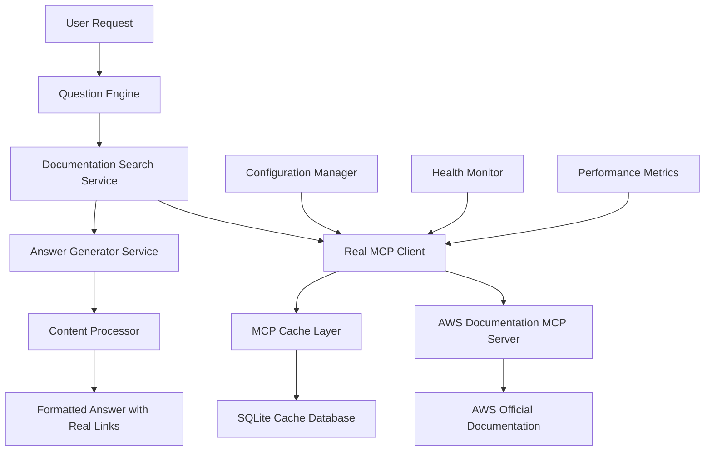

# Design Document

## Overview

This design document outlines the implementation of real MCP (Model Context Protocol) integration with the AWS Documentation server to replace the current mock/simulated data system. The solution will provide accurate, detailed answers with correct source links by connecting to actual AWS documentation sources.

## Architecture

### High-Level Architecture



### Component Interaction Flow

1. **Request Processing**: User question → Question Engine → Documentation Search Service
2. **MCP Integration**: Search Service → Real MCP Client → AWS Documentation MCP Server
3. **Content Retrieval**: MCP Server → AWS Official Documentation → Structured Results
4. **Answer Generation**: Real Documentation → Content Processor → Enhanced Answer Generator
5. **Response Delivery**: Formatted Answer with Accurate Links → User

## Components and Interfaces

### 1. Real MCP Client (`RealMCPClient`)

**Purpose**: Establish actual connection to AWS Documentation MCP server

**Key Methods**:
```typescript
interface RealMCPClient {
  // Connection management
  connect(): Promise<MCPConnection>
  disconnect(): Promise<void>
  isConnected(): boolean
  
  // Documentation operations
  searchDocumentation(query: string, options: SearchOptions): Promise<RealSearchResults>
  readDocumentationPage(url: string): Promise<DocumentationContent>
  getRecommendations(url: string): Promise<RelatedDocumentation>
  
  // Server capabilities
  listAvailableTopics(): Promise<MCPTopic[]>
  getServerInfo(): Promise<MCPServerInfo>
  
  // Health and monitoring
  healthCheck(): Promise<HealthStatus>
  getMetrics(): Promise<MCPMetrics>
}
```

**Configuration**:
```typescript
interface MCPClientConfig {
  serverEndpoint: string
  authentication: MCPAuthConfig
  timeout: number
  retryPolicy: RetryConfig
  connectionPool: PoolConfig
}
```

### 2. Enhanced Documentation Search Service

**Purpose**: Coordinate real documentation search with improved result processing

**Key Enhancements**:
```typescript
interface EnhancedSearchService {
  // Real search operations
  performRealSearch(request: SearchRequest): Promise<RealSearchResults>
  
  // Content processing
  processRealContent(results: RealSearchResults): Promise<ProcessedResults>
  
  // Quality assessment
  assessContentQuality(content: DocumentationContent): QualityScore
  
  // Source validation
  validateSourceUrls(urls: string[]): Promise<ValidationResults>
}
```

### 3. Advanced Answer Generator

**Purpose**: Generate comprehensive answers from real AWS documentation

**Enhanced Capabilities**:
```typescript
interface AdvancedAnswerGenerator {
  // Content synthesis
  synthesizeFromRealSources(sources: RealDocumentationSources): Promise<SynthesizedContent>
  
  // Formatting preservation
  preserveAwsFormatting(content: string): FormattedContent
  
  // Code example extraction
  extractCodeExamples(documentation: DocumentationContent): CodeExample[]
  
  // Step-by-step generation
  generateProcedures(content: DocumentationContent): ProcedureSteps[]
  
  // Source attribution
  createSourceAttribution(sources: DocumentationSource[]): SourceReferences
}
```

### 4. Content Processing Pipeline

**Purpose**: Process and enhance real AWS documentation content

**Processing Stages**:
```typescript
interface ContentProcessor {
  // Content extraction
  extractStructuredContent(rawContent: string): StructuredContent
  
  // Format preservation
  preserveMarkdownFormatting(content: string): string
  preserveCodeBlocks(content: string): CodeBlock[]
  preserveTables(content: string): Table[]
  
  // Content enhancement
  enhanceWithMetadata(content: StructuredContent): EnhancedContent
  addNavigationLinks(content: StructuredContent): NavigableContent
  
  // Quality assurance
  validateContentIntegrity(content: StructuredContent): ValidationResult
}
```

### 5. Intelligent Caching System

**Purpose**: Optimize performance while ensuring content freshness

**Caching Strategy**:
```typescript
interface IntelligentCache {
  // Multi-level caching
  l1Cache: MemoryCache        // Fast access, short TTL
  l2Cache: DatabaseCache      // Persistent, medium TTL
  l3Cache: FileSystemCache    // Large content, long TTL
  
  // Cache operations
  get(key: string, level?: CacheLevel): Promise<CachedContent | null>
  set(key: string, content: any, ttl: number, level?: CacheLevel): Promise<void>
  
  // Cache management
  invalidate(pattern: string): Promise<void>
  getStats(): CacheStatistics
  cleanup(): Promise<void>
}
```

## Data Models

### Real Documentation Result

```typescript
interface RealDocumentationResult {
  id: string
  url: string                    // Actual AWS documentation URL
  title: string                  // Real page title
  content: string                // Full content from AWS docs
  summary: string                // Extracted summary
  lastModified: Date             // AWS documentation last update
  serviceCategory: string        // AWS service category
  documentationType: 'guide' | 'reference' | 'tutorial' | 'troubleshooting'
  
  // Content structure
  sections: DocumentationSection[]
  codeExamples: CodeExample[]
  procedures: ProcedureStep[]
  prerequisites: string[]
  
  // Metadata
  awsServices: string[]          // Services mentioned in content
  regions: string[]              // Applicable AWS regions
  pricing: PricingInfo | null    // Pricing information if available
  
  // Quality indicators
  qualityScore: number           // Content quality assessment
  completeness: number           // Content completeness score
  accuracy: number               // Information accuracy score
}
```

### Enhanced Search Results

```typescript
interface EnhancedSearchResults {
  searchId: string
  query: string
  results: RealDocumentationResult[]
  
  // Search metadata
  totalResults: number
  searchTime: number
  mcpServerVersion: string
  
  // Content analysis
  topServices: string[]          // Most relevant AWS services
  contentTypes: string[]         // Types of documentation found
  difficultyLevel: 'beginner' | 'intermediate' | 'advanced'
  
  // Source quality
  averageQualityScore: number
  sourceDistribution: SourceDistribution
  
  // Recommendations
  relatedTopics: string[]
  suggestedFollowUp: string[]
}
```

### Comprehensive Answer

```typescript
interface ComprehensiveAnswer {
  answerId: string
  question: string
  answer: string                 // Rich formatted answer
  
  // Content structure
  overview: string
  detailedSteps: ProcedureStep[]
  codeExamples: CodeExample[]
  prerequisites: string[]
  troubleshooting: TroubleshootingTip[]
  
  // Source information
  primarySources: DocumentationSource[]
  additionalReferences: DocumentationSource[]
  lastUpdated: Date
  
  // Quality metrics
  confidence: number
  completeness: number
  accuracy: number
  
  // User guidance
  estimatedReadTime: number
  difficultyLevel: string
  nextSteps: string[]
}
```

## Correctness Properties

*A property is a characteristic or behavior that should hold true across all valid executions of a system-essentially, a formal statement about what the system should do. Properties serve as the bridge between human-readable specifications and machine-verifiable correctness guarantees.*

### Property Reflection

After analyzing all acceptance criteria, I identified several areas where properties can be consolidated to eliminate redundancy:

- **Connection and Authentication Properties**: Properties 1.1, 1.3, and 8.1 all relate to MCP connection management and can be combined into comprehensive connection properties
- **Error Handling Properties**: Properties 1.2, 6.2, 6.3, and 8.5 all deal with error handling and can be consolidated into comprehensive error management properties  
- **Caching Properties**: Properties 5.3, 7.1, and 7.4 all relate to caching behavior and can be combined into unified caching properties
- **Content Accuracy Properties**: Properties 2.3, 3.1, 3.2, and 4.1 all ensure content accuracy and can be consolidated into comprehensive accuracy properties
- **Source Attribution Properties**: Properties 10.1, 10.2, and 10.4 all relate to source linking and can be combined into unified attribution properties

The following properties represent the unique, non-redundant correctness requirements:

### Connection and Protocol Properties

**Property 1: MCP Server Connection Management**
*For any* system startup or configuration change, the MCP client should successfully establish and maintain connection to the real AWS Documentation MCP server with proper authentication and protocol compliance
**Validates: Requirements 1.1, 1.3, 8.1**

**Property 2: Connection Resilience with Exponential Backoff**
*For any* connection failure scenario, the MCP client should implement proper retry logic with exponential backoff timing and circuit breaker protection
**Validates: Requirements 1.5, 6.4**

### Content Accuracy and Validation Properties

**Property 3: Real Documentation Source Usage**
*For any* search or content retrieval operation, the system should access actual AWS documentation sources rather than mock data, and all returned URLs should be valid AWS documentation links
**Validates: Requirements 2.1, 2.2, 5.1**

**Property 4: Content Extraction Accuracy**
*For any* AWS documentation content, extracted titles, context, procedures, and technical details should accurately match the source documentation
**Validates: Requirements 2.3, 3.1, 3.3, 4.1**

**Property 5: Server Response Validation**
*For any* MCP server response, the client should validate the response against the MCP protocol schema before processing
**Validates: Requirements 1.4**

### Search and Discovery Properties

**Property 6: Comprehensive Search Topic Support**
*For any* supported MCP search topic (general, troubleshooting, reference_documentation, etc.), the search service should successfully query and return relevant results
**Validates: Requirements 2.4**

**Property 7: Intelligent Fallback Suggestions**
*For any* search query that returns no results, the system should provide helpful suggestions based on the real AWS service catalog
**Validates: Requirements 2.5**

**Property 8: New Service Discovery**
*For any* newly announced AWS service, the search service should be able to find and return information about it
**Validates: Requirements 5.4**

### Answer Generation Properties

**Property 9: Comprehensive Answer Generation**
*For any* generated answer, it should include accurate source links, relevant code examples from AWS documentation, and proper source prioritization when multiple sources are available
**Validates: Requirements 3.2, 3.4, 3.5**

**Property 10: Technical Detail Inclusion**
*For any* technical question about AWS services, generated answers should include specific parameter names, current service capabilities, actual CLI commands, and prerequisites from AWS documentation
**Validates: Requirements 4.2, 4.3, 4.4**

**Property 11: Service Context Completeness**
*For any* AWS service discussion, answers should include current pricing models and regional availability information when available in documentation
**Validates: Requirements 4.5**

### Content Processing Properties

**Property 12: Format Preservation**
*For any* AWS documentation content, the system should preserve original formatting including code blocks, tables, lists, step numbering, and hierarchy
**Validates: Requirements 9.1, 9.2**

**Property 13: Rich Content Inclusion**
*For any* AWS documentation that contains diagrams, configuration parameters, warnings, or notes, these elements should be properly extracted and included in generated answers
**Validates: Requirements 9.3, 9.4, 9.5**

### Caching and Performance Properties

**Property 14: Intelligent Caching Behavior**
*For any* MCP request, the system should use cached results when available to reduce redundant calls, while respecting cache TTL to ensure content freshness
**Validates: Requirements 5.3, 7.1, 7.4**

**Property 15: Efficient Content Handling**
*For any* large documentation page or complex query, the system should handle content efficiently through streaming, pagination, or parallel processing
**Validates: Requirements 7.2, 7.3**

**Property 16: Connection Resource Optimization**
*For any* MCP client operations, connection pooling should be used to optimize network resource usage
**Validates: Requirements 7.5**

### Error Handling and Fallback Properties

**Property 17: Comprehensive Error Handling**
*For any* MCP server error, timeout, or unavailability, the system should log detailed diagnostic information and provide appropriate user messaging
**Validates: Requirements 1.2, 6.2, 6.3, 8.5**

**Property 18: Graceful Fallback with User Notification**
*For any* fallback scenario (server unavailability, cached results), the system should clearly indicate to users that results may not be current
**Validates: Requirements 6.1, 6.5**

**Property 19: Documentation Structure Resilience**
*For any* AWS documentation structure change, the system should continue to operate gracefully without breaking
**Validates: Requirements 5.5**

### Real-time Updates Properties

**Property 20: Live Documentation Access**
*For any* documentation access, the system should retrieve the latest version without requiring application restart
**Validates: Requirements 5.2**

### Monitoring and Diagnostics Properties

**Property 21: Performance Metrics Tracking**
*For any* MCP operation, the system should log performance metrics, success rates, and cache statistics
**Validates: Requirements 8.2, 8.4**

**Property 22: Health Status Reporting**
*For any* health check request, the system should accurately report MCP server connectivity status
**Validates: Requirements 8.3**

### Source Attribution Properties

**Property 23: Comprehensive Source Attribution**
*For any* generated answer, the system should include direct links to specific AWS documentation sections used, list all contributing sources, and provide section-specific links within longer pages
**Validates: Requirements 10.1, 10.2, 10.5**

**Property 24: Source Freshness Indication**
*For any* documentation source with available update dates, the system should include the last updated date and link to official service overview pages
**Validates: Requirements 10.3, 10.4**

## Error Handling

### MCP Server Connection Errors

**Connection Failure Handling**:
- Implement exponential backoff retry strategy (1s, 2s, 4s, 8s, 16s max)
- Circuit breaker pattern to prevent overwhelming failed servers
- Graceful degradation to cached content when available
- Clear user messaging about connectivity issues

**Authentication Errors**:
- Validate MCP authentication credentials on startup
- Refresh authentication tokens automatically
- Log authentication failures with sufficient detail for debugging
- Provide clear error messages for configuration issues

### Content Processing Errors

**Invalid Documentation Format**:
- Validate AWS documentation structure before processing
- Handle missing or malformed content gracefully
- Log content processing errors with source URLs
- Provide fallback content when processing fails

**Search Result Errors**:
- Validate search results against expected schema
- Handle empty or invalid search responses
- Implement fallback search strategies for failed queries
- Cache successful results to reduce failure impact

### Performance and Timeout Handling

**Request Timeout Management**:
- Configure appropriate timeouts for different MCP operations
- Implement request cancellation for long-running operations
- Provide user feedback for slow operations
- Log timeout events for performance monitoring

**Cache Failure Handling**:
- Handle cache corruption or unavailability gracefully
- Implement cache rebuild mechanisms
- Provide direct MCP access when cache fails
- Monitor cache health and performance

## Testing Strategy

### Dual Testing Approach

The testing strategy combines unit tests for specific scenarios with property-based tests for comprehensive coverage:

**Unit Tests**:
- MCP server connection establishment and authentication
- Error handling for specific failure scenarios
- Content processing for known AWS documentation formats
- Cache operations and TTL behavior
- Configuration validation and health checks

**Property-Based Tests**:
- Connection resilience across various failure scenarios (Property 2)
- Content accuracy validation across different AWS services (Property 4)
- Search functionality across all supported topics (Property 6)
- Answer generation quality across question types (Property 9)
- Caching behavior across different content types (Property 14)
- Error handling across various error conditions (Property 17)
- Source attribution across different documentation sources (Property 23)

### Property-Based Testing Configuration

**Testing Framework**: Use Hypothesis (Python) or fast-check (TypeScript/JavaScript)
**Minimum Iterations**: 100 per property test
**Test Tagging**: Each property test must reference its design document property

**Example Property Test Tags**:
- **Feature: mcp-integration-improvement, Property 1: MCP Server Connection Management**
- **Feature: mcp-integration-improvement, Property 4: Content Extraction Accuracy**
- **Feature: mcp-integration-improvement, Property 14: Intelligent Caching Behavior**

### Integration Testing

**Real MCP Server Testing**:
- Test against actual AWS Documentation MCP server in staging environment
- Validate real documentation retrieval and processing
- Test authentication and authorization flows
- Verify content accuracy against known AWS documentation

**Performance Testing**:
- Load testing with concurrent MCP requests
- Cache performance under various load conditions
- Memory usage monitoring during large content processing
- Response time validation for different query types

**End-to-End Testing**:
- Complete user journey from question to answer with real documentation
- Cross-service integration testing
- Error scenario testing with real server failures
- Content freshness validation over time

### Test Data Management

**Real Documentation Samples**:
- Curated set of AWS documentation URLs for testing
- Known good examples for each AWS service category
- Edge cases and error scenarios from real documentation
- Version control for test documentation snapshots

**Mock Server for Development**:
- Maintain mock MCP server for development and CI/CD
- Simulate various error conditions and edge cases
- Performance testing without impacting real AWS infrastructure
- Offline development capability

## Implementation Notes

### MCP Protocol Integration

**Protocol Compliance**:
- Follow MCP specification for all client-server communication
- Implement proper message framing and error handling
- Support MCP capability negotiation and versioning
- Handle MCP server capability changes gracefully

**AWS Documentation MCP Server Specifics**:
- Understand AWS-specific MCP extensions and capabilities
- Handle AWS documentation structure and metadata
- Support AWS service categorization and tagging
- Implement AWS-specific search and filtering options

### Performance Optimization

**Connection Management**:
- Implement connection pooling for MCP server connections
- Use persistent connections where supported by MCP server
- Implement connection health monitoring and recovery
- Optimize connection parameters for AWS documentation access patterns

**Content Processing Optimization**:
- Stream large documentation content to reduce memory usage
- Implement parallel processing for multiple documentation sources
- Use efficient parsing algorithms for AWS documentation formats
- Optimize content extraction and formatting preservation

### Security Considerations

**Authentication and Authorization**:
- Secure storage of MCP server credentials
- Implement proper authentication token management
- Support role-based access to different documentation categories
- Audit logging for all MCP server interactions

**Content Validation**:
- Validate all content received from MCP server
- Sanitize content before processing and display
- Implement content integrity checks
- Protect against malicious or corrupted documentation

### Monitoring and Observability

**Metrics Collection**:
- MCP server response times and success rates
- Cache hit rates and performance metrics
- Content processing times and error rates
- User satisfaction metrics for answer quality

**Logging Strategy**:
- Structured logging for all MCP operations
- Performance logging with timing information
- Error logging with sufficient context for debugging
- Audit logging for compliance and security

**Health Monitoring**:
- MCP server connectivity health checks
- Cache system health and performance monitoring
- Content freshness and accuracy monitoring
- System resource usage monitoring

This design provides a comprehensive foundation for implementing real MCP integration that will deliver accurate, detailed answers with correct source links from actual AWS documentation.

<function_calls>
<invoke name="prework">
<parameter name="featureName">mcp-integration-improvement